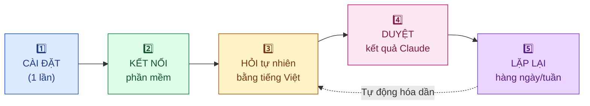

# 🤖 Agent Teams cho Doanh Nghiệp Nhỏ — CESGLOBAL

> **Plugin Claude Cowork 100% Tiếng Việt** — Bộ trợ lý AI tự động hóa vận hành cho doanh nghiệp nhỏ Việt Nam. Claude làm việc như một đội ngũ trợ lý thông minh: bạn ra lệnh, Claude thực thi, và **bạn phê duyệt mọi bước quan trọng**.

---

## 📖 Giới Thiệu — Đọc Trước Khi Dùng

### Plugin này là gì?

Đây là một **bộ kỹ năng (plugin)** dành cho Claude Cowork — ứng dụng desktop của Claude dành cho công việc. Khi cài plugin này, Claude sẽ có thêm **31 kỹ năng chuyên biệt** giúp bạn điều hành doanh nghiệp, bao gồm:

- 📊 **Tài chính**: Xem dòng tiền, đóng sổ cuối tháng, lập báo cáo P&L, cảnh báo thanh khoản
- 📣 **Marketing**: Lên chiến lược nội dung, tạo ảnh Canva, chạy campaign email
- 🤝 **Bán hàng & CRM**: Phân loại lead, cập nhật HubSpot, gọi điện cho khách ưu tiên
- 👥 **Nhân sự**: Đăng tuyển dụng, tạo gói offer, chuẩn bị phỏng vấn
- ⚙️ **Vận hành**: Xử lý khiếu nại, soạn phản hồi khách hàng, xem xét hợp đồng

### 🏢 Sơ đồ Tổ chức AI Agent Teams

Plugin được tổ chức **như một công ty thật**: bạn là CEO, Claude là Tổng điều phối, và 31 kỹ năng được sắp xếp thành **4 phòng ban chuyên môn** với các "nhân viên AI" cụ thể.

```mermaid
flowchart TB
    CEO("👔 <b>BẠN — CEO / Chủ Doanh Nghiệp</b><br/>━━━━━━━━━━━━━━━<br/>📌 Ra quyết định cuối cùng<br/>📌 Phê duyệt mọi hành động"):::ceo

    CLAUDE("🤖 <b>CLAUDE AI — Tổng Điều Phối</b><br/>━━━━━━━━━━━━━━━<br/>📌 Hiểu yêu cầu tiếng Việt tự nhiên<br/>📌 Phân việc đúng phòng ban<br/>📌 Tổng hợp kết quả trình bạn"):::claude

    CEO <==>|"Trao đổi & phê duyệt"| CLAUDE

    CLAUDE --> DEPT1
    CLAUDE --> DEPT2
    CLAUDE --> DEPT3
    CLAUDE --> DEPT4

    subgraph DEPT1["🏠 PHÒNG ĐIỀU HÀNH — 6 kỹ năng"]
        direction TB
        D1A["📊 Báo cáo tổng quan"]
        D1B["📅 Tóm tắt đầu tuần"]
        D1C["📋 Tổng kết cuối tuần"]
        D1D["📈 Báo cáo quý"]
        D1E["🧭 Điều phối thông minh"]
        D1F["⚙️ Giới thiệu & cài đặt"]
    end

    subgraph DEPT2["💰 PHÒNG TÀI CHÍNH — 10 kỹ năng"]
        direction TB
        D2A["💵 Dự báo dòng tiền"]
        D2B["📒 Đóng sổ cuối tháng"]
        D2C["📊 Phân tích biên lợi nhuận"]
        D2D["⏰ Nhắc nợ khách hàng"]
        D2E["💼 Kế hoạch trả lương"]
        D2F["🏷️ Kiểm tra giá bán"]
        D2G["🧾 Chuẩn bị quyết toán thuế"]
        D2H["📑 Tổ chức mùa quyết toán"]
        D2I["🔄 Đóng sổ tháng"]
        D2J["⚠️ Cảnh báo cuối tháng"]
    end

    subgraph DEPT3["📣 PHÒNG MARKETING & SALES — 8 kỹ năng"]
        direction TB
        D3A["🎯 Chiến lược nội dung"]
        D3B["📧 Chạy campaign"]
        D3C["🖼️ Tạo ảnh Canva"]
        D3D["🛒 Tóm tắt bán hàng"]
        D3E["⭐ Phân loại lead"]
        D3F["📞 Danh sách gọi điện"]
        D3G["💾 Cập nhật CRM"]
        D3H["🧹 Dọn dẹp CRM"]
    end

    subgraph DEPT4["👥 PHÒNG NHÂN SỰ & CSKH — 7 kỹ năng"]
        direction TB
        D4A["🧑‍💼 Tuyển dụng"]
        D4B["📄 Xem xét hợp đồng"]
        D4C["🔍 Review hợp đồng (nâng cao)"]
        D4D["💬 Xử lý khiếu nại"]
        D4E["🤝 Giải quyết phàn nàn"]
        D4F["🌡️ Đo nhiệt độ khách hàng"]
        D4G["❤️ Kiểm tra mạch đập KH"]
    end

    classDef ceo fill:#1e293b,stroke:#0f172a,stroke-width:3px,color:#fff
    classDef claude fill:#7c3aed,stroke:#5b21b6,stroke-width:3px,color:#fff
```



> 💡 **Cách vận hành**: Bạn nói "Tháng này dòng tiền sao rồi?" → Claude nhận yêu cầu → tự động gọi kỹ năng **Dự báo dòng tiền** trong Phòng Tài chính → kết nối QuickBooks → trình báo cáo → chờ bạn phê duyệt hành động tiếp theo.

---

## 🎯 Plugin Này Hỗ Trợ Doanh Nghiệp Được Gì?

Doanh nghiệp nhỏ thường **thiếu người** nhưng vẫn phải làm đủ việc của một công ty lớn. Plugin này giải quyết 6 vấn đề cốt lõi:

### 1️⃣ Tiết kiệm 10–20 giờ/tuần cho chủ doanh nghiệp
Thay vì tự tay làm báo cáo, gửi nhắc nợ, soạn email phản hồi khách... Claude làm sẵn — bạn chỉ duyệt.

### 2️⃣ Không cần thuê thêm nhân sự
1 chủ doanh nghiệp + Claude = đội ngũ tương đương kế toán bán thời gian + marketer + sales admin + HR.

### 3️⃣ Không bỏ sót việc quan trọng
- ⚠️ Cảnh báo trước khi hết tiền trả lương (ngày 25 hàng tháng)
- 📞 Nhắc khách nợ tự động
- 📊 Báo cáo định kỳ không bị quên

### 4️⃣ Ra quyết định dựa trên số liệu, không phải cảm tính
Mọi báo cáo (P&L, dòng tiền, lead quality, hiệu quả campaign) đều rút từ phần mềm thật, không phải đoán.

### 5️⃣ Giảm rủi ro pháp lý & tài chính
- Review hợp đồng phát hiện điều khoản bất lợi trước khi ký
- Đối chiếu QuickBooks vs cổng thanh toán → phát hiện sai lệch sớm
- Chuẩn bị quyết toán thuế đầy đủ → tránh phạt

### 6️⃣ Chăm sóc khách hàng chuyên nghiệp hơn
Phản hồi khiếu nại trong giờ thay vì ngày. Theo dõi "nhiệt độ" khách hàng để giữ chân khách cũ.

| 📌 Tình huống thực tế | ⏱️ Trước khi có plugin | ✅ Sau khi có plugin |
|---|---|---|
| Lập báo cáo dòng tiền tháng | 2-3 giờ làm tay | 5 phút duyệt báo cáo Claude tạo |
| Soạn 10 email nhắc nợ | 1 giờ viết từng cái | Claude soạn sẵn, bạn duyệt 10 phút |
| Phân tích lead nào ưu tiên gọi | Đoán theo cảm tính | Claude xếp hạng theo dữ liệu CRM |
| Tạo 5 ảnh đăng Facebook | 2 giờ ngồi Canva | 15 phút duyệt mẫu Claude tạo |
| Review hợp đồng 20 trang | Gửi luật sư (5 triệu) | Claude flag rủi ro miễn phí, luật sư chỉ check điều khoản đáng ngờ |

---

## 🔄 Doanh Nghiệp Sử Dụng Repo Này Như Thế Nào?

### Quy trình 5 bước từ A đến Z



### Lộ trình triển khai theo tuần

**📅 Tuần 1 — Khởi động (2 giờ)**
1. Cài Claude Cowork → cài plugin từ repo này (xem [Hướng dẫn cài đặt](#-hướng-dẫn-cài-đặt))
2. Kết nối **1–2 phần mềm quan trọng nhất** với bạn (thường là QuickBooks + HubSpot, hoặc Gmail + Calendar)
3. Thử ngay câu: *"Cho tôi xem tình hình kinh doanh hôm nay"*

**📅 Tuần 2 — Tài chính (việc cấp bách nhất)**
- Sáng thứ 2: *"Tóm tắt tài chính tuần qua"*
- Giữa tuần: *"Khách nào đang nợ tiền tôi? Soạn email nhắc nợ"*
- Cuối tháng: *"Đóng sổ tháng và lập P&L"*

**📅 Tuần 3 — Bán hàng & Marketing**
- *"Top 5 lead tôi nên gọi hôm nay"*
- *"Lên kế hoạch nội dung 30 ngày cho Facebook"*
- *"Tạo 5 ảnh đăng cho sản phẩm X"*

**📅 Tuần 4 — Vận hành định kỳ**
- Tự động hóa: báo cáo tuần, nhắc nợ, cập nhật CRM
- Khi cần: tuyển dụng, review hợp đồng, xử lý khiếu nại

### Ai trong doanh nghiệp dùng plugin này?

| Vai trò | Sử dụng plugin để... |
|---|---|
| 👔 **Chủ doanh nghiệp / CEO** | Xem báo cáo tổng quan, quyết định chiến lược, duyệt hành động |
| 💰 **Kế toán / Quản lý tài chính** | Đóng sổ, đối soát, dự báo dòng tiền, chuẩn bị quyết toán |
| 📣 **Marketing / Sales** | Lên content, chạy campaign, phân loại lead, cập nhật CRM |
| 👥 **HR / Admin** | Đăng tuyển, soạn offer, xem xét hợp đồng |
| 📞 **Chăm sóc khách hàng** | Xử lý khiếu nại, đo lường feedback khách |

> 💡 **Doanh nghiệp 1–5 người**: 1 chủ doanh nghiệp có thể dùng cả 31 kỹ năng. Plugin đóng vai trò như một đội ngũ ảo.
>
> 💡 **Doanh nghiệp 10–50 người**: Mỗi nhân viên dùng kỹ năng thuộc phòng ban của mình. Chủ doanh nghiệp dùng nhóm "Điều hành" để theo dõi tổng thể.

---

### Ai nên dùng plugin này?

- Chủ doanh nghiệp nhỏ/vừa (1–50 nhân viên)
- Người mới bắt đầu dùng Claude Cowork và muốn áp dụng ngay vào công việc
- Team muốn tự động hóa các tác vụ lặp đi lặp lại mà không cần thuê thêm nhân sự

### Claude hoạt động như thế nào với plugin này?

```
Bạn nói chuyện với Claude bằng tiếng Việt bình thường
         ↓
Claude tự nhận biết bạn cần kỹ năng gì
         ↓
Claude kết nối với các phần mềm của bạn (QuickBooks, HubSpot, v.v.)
         ↓
Claude thực hiện công việc và trình bày kết quả
         ↓
Bạn phê duyệt hoặc điều chỉnh trước khi Claude thực thi
```

> ⚠️ **Nguyên tắc vàng**: Claude **không bao giờ** tự ý chuyển tiền, gửi email đến khách hàng, hoặc đăng nội dung mà không có sự phê duyệt của bạn.

---

## 🚀 Hướng Dẫn Cài Đặt

### Bước 1: Cài Claude Cowork

Tải Claude desktop app từ [claude.ai/download](https://claude.ai/download) và đăng nhập bằng tài khoản Claude của bạn (cần gói Pro hoặc Teams).

### Bước 2: Cài Plugin Này

1. Mở Claude Cowork
2. Click vào biểu tượng **Plugin** ở thanh bên trái
3. Click **"Cài đặt từ file"** hoặc **"Install from GitHub"**
4. Nhập URL: `https://github.com/Peternguyen91/agent-teams-sme-cesglobal`
5. Click **Cài đặt** và chờ 30 giây

### Bước 3: Kết Nối Phần Mềm Của Bạn

Plugin hỗ trợ 12 phần mềm phổ biến. **Bạn không cần kết nối tất cả** — kết nối ít nhất 1-2 phần mềm là có thể bắt đầu ngay:

| Phần mềm | Dùng để làm gì |
|----------|----------------|
| **QuickBooks** | Đọc dữ liệu tài chính, P&L, dòng tiền |
| **PayPal** | Theo dõi thanh toán, gửi nhắc nợ |
| **HubSpot** | Quản lý CRM, lead, pipeline bán hàng |
| **Canva** | Tạo ảnh marketing tự động |
| **Google Gmail** | Đọc email, soạn phản hồi khách hàng |
| **Google Calendar** | Xem lịch, lên kế hoạch tuần |
| **Google Drive** | Lưu báo cáo, tài liệu tự động |
| **Slack** | Gửi thông báo nội bộ cho team |
| **Stripe / Square** | Theo dõi doanh thu bán hàng |
| **DocuSign** | Ký hợp đồng điện tử |
| **Microsoft 365** | Tích hợp Outlook, Teams |
| **Canva** | Thiết kế marketing |

**Cách kết nối**: Trong Claude Cowork → Plugin → Chọn plugin này → Tab "Kết nối" → Chọn phần mềm → Đăng nhập tài khoản của bạn.

### Bước 4: Bắt Đầu Ngay

Sau khi cài xong, hãy thử ngay câu đầu tiên:

```
"Cho tôi xem tình hình kinh doanh hôm nay"
```

Claude sẽ tự động thu thập dữ liệu từ các phần mềm đã kết nối và tạo báo cáo tổng quan cho bạn.

---

## 💬 Cách Sử Dụng — Nói Chuyện Tự Nhiên

Plugin này được thiết kế để bạn **nói chuyện tự nhiên bằng tiếng Việt**, không cần nhớ lệnh phức tạp.

### Ví dụ các câu bạn có thể nói:

**Tài chính:**
- *"Tháng này dòng tiền như thế nào?"*
- *"Tôi có đủ tiền trả lương không?"*
- *"Khách nào đang nợ tiền tôi?"*
- *"Cho tôi xem P&L tháng trước"*
- *"Lợi nhuận theo sản phẩm thế nào?"*

**Marketing:**
- *"Tôi nên đăng gì trong tháng này?"*
- *"Tạo bài đăng Facebook cho sản phẩm X"*
- *"Chạy campaign email cho khách hàng cũ"*

**Bán hàng:**
- *"Hôm nay tôi nên gọi cho ai trước?"*
- *"Cập nhật CRM sau cuộc họp vừa rồi"*
- *"Phân tích pipeline bán hàng tuần này"*

**Nhân sự:**
- *"Tôi muốn tuyển 1 nhân viên kế toán"*
- *"Soạn offer letter cho ứng viên X"*

**Khách hàng:**
- *"Khách đang phàn nàn về X, giúp tôi soạn phản hồi"*
- *"Xem xét hợp đồng này có vấn đề gì không?"*

---

## 📋 Danh Sách 31 Kỹ Năng

### 🏠 Nhóm 1 — Tổng Quan & Điều Phối (Dùng Hàng Ngày)

| Kỹ năng | Khi nào dùng |
|---------|--------------|
| **bao-cao-tong-quan** | Xem tình hình kinh doanh tổng thể |
| **dieu-phoi-thong-minh** | Claude tự hiểu bạn cần gì và dẫn đến đúng kỹ năng |
| **gioi-thieu-va-cai-dat** | Lần đầu dùng, kết nối phần mềm |
| **tom-tat-dau-tuan** | Bản tin sáng thứ 2, lên kế hoạch tuần |
| **tong-ket-cuoi-tuan** | Tóm tắt thứ 6, đánh giá kết quả |
| **bao-cao-quy** | Báo cáo quý cho ban lãnh đạo |

### 💰 Nhóm 2 — Tài Chính (Quan Trọng Nhất)

| Kỹ năng | Khi nào dùng |
|---------|--------------|
| **dong-so-cuoi-thang** | Đối soát sổ sách, đóng tháng |
| **du-bao-dong-tien** | Dự báo 30/60/90 ngày tiền mặt |
| **phan-tich-bien-loi-nhuan** | Xem margin theo sản phẩm/dịch vụ |
| **nhac-no-khach-hang** | Gửi nhắc nhở khách chưa thanh toán |
| **ke-hoach-tra-luong** | Đảm bảo đủ tiền trả lương |
| **kiem-tra-gia-ban** | Phân tích giá theo sản phẩm |
| **chuan-bi-quyet-toan-thue** | Tài liệu cho kế toán thuế |
| **to-chuc-mua-quyet-toan** | Chuẩn bị tài liệu cuối năm |
| **dong-so-thang** | Đối soát QuickBooks vs cổng thanh toán |
| **canh-bao-cuoi-thang** | Cảnh báo sớm ngày 25 hàng tháng |

### 📣 Nhóm 3 — Marketing & Bán Hàng

| Kỹ năng | Khi nào dùng |
|---------|--------------|
| **chien-luoc-noi-dung** | Lên kế hoạch nội dung 30 ngày |
| **chay-campaign** | Chạy campaign đầu đến cuối |
| **phan-loai-lead** | Xếp hạng lead ưu tiên |
| **tao-anh-canva** | Tự động tạo ảnh đăng mạng xã hội |
| **tom-tat-ban-hang** | Top sản phẩm bán chạy/chậm |
| **danh-sach-goi-dien** | 5 khách cần gọi hôm nay |
| **cap-nhat-crm** | Cập nhật HubSpot tự động |
| **don-dep-crm** | Dọn dẹp dữ liệu CRM cũ |

### 👥 Nhóm 4 — Nhân Sự & Vận Hành

| Kỹ năng | Khi nào dùng |
|---------|--------------|
| **tuyen-dung** | Đăng tuyển, phỏng vấn, offer letter |
| **xem-xet-hop-dong** | Phát hiện rủi ro trong hợp đồng |
| **review-hop-dong** | Phiên bản nâng cao xem xét hợp đồng |
| **xu-ly-khieu-nai** | Soạn phản hồi khiếu nại khách hàng |
| **giai-quyet-phan-nan** | Xử lý phàn nàn đầu đến cuối |
| **do-nhiet-do-khach-hang** | Tổng hợp feedback, phân tích xu hướng |
| **kiem-tra-mach-dap-khach-hang** | Phân tích top 3 vấn đề khách phàn nàn |

---

## ❓ Câu Hỏi Thường Gặp

**Q: Plugin có đọc được dữ liệu thật của doanh nghiệp tôi không?**
A: Có, khi bạn kết nối phần mềm (QuickBooks, HubSpot...) Claude sẽ đọc dữ liệu thực của bạn. Dữ liệu này chỉ dùng trong phiên làm việc đó và không được lưu lại.

**Q: Claude có tự ý gửi email hoặc chuyển tiền không?**
A: Không bao giờ. Claude luôn trình bày kết quả và hỏi bạn "Bạn có muốn thực hiện không?" trước mọi hành động ảnh hưởng đến tiền hoặc khách hàng.

**Q: Tôi không có QuickBooks thì có dùng được không?**
A: Được. Bạn có thể cung cấp số liệu trực tiếp qua chat (ví dụ: "Doanh thu tháng 5 là 200 triệu, chi phí là 130 triệu"), Claude sẽ phân tích dựa trên thông tin bạn cung cấp.

**Q: Có cần biết kỹ thuật để dùng không?**
A: Không. Chỉ cần biết gõ tiếng Việt và nói chuyện bình thường với Claude là đủ.

**Q: Plugin có phù hợp với doanh nghiệp tôi không nếu tôi không dùng các phần mềm trên?**
A: Vẫn phù hợp. Nhiều kỹ năng hoạt động tốt chỉ với thông tin bạn cung cấp qua chat, không cần phần mềm nào cả.

---

## 🏢 Về CES GLOBAL

### Giới thiệu

**Công ty Cổ phần Công nghệ Trí tuệ Nhân tạo CES GLOBAL** là đơn vị tiên phong trong lĩnh vực **đào tạo, tư vấn và triển khai AI cho doanh nghiệp tại Việt Nam**. CES Global đặt mục tiêu trở thành đơn vị dẫn đầu trong đào tạo AI và các giải pháp đổi mới đột phá, đồng hành cùng doanh nghiệp Việt bứt phá trong kỷ nguyên số.

> **Sứ mệnh**: Lấy **con người làm trung tâm**, **bảo mật dữ liệu** là nguyên tắc cốt lõi, và **sự phát triển bền vững của khách hàng** là thước đo thành công.

### Lĩnh vực hoạt động

| 🎯 Mảng | Mô tả |
|---|---|
| **Đào tạo AI** | Xây dựng "khung năng lực AI" cho doanh nghiệp, đào tạo nhân sự ứng dụng AI vào công việc thực tế |
| **Tư vấn chiến lược AI-First** | Tư vấn lộ trình chuyển đổi số và áp dụng AI Agent vào vận hành doanh nghiệp |
| **Triển khai giải pháp AI** | Tối ưu vận hành, nâng cao hiệu quả kinh doanh, tạo lợi thế cạnh tranh bằng AI |
| **Agentic AI & Automation** | Phát triển các AI Agent chuyên biệt theo ngành/phòng ban (như plugin này) |

### Khách hàng tiêu biểu

CES GLOBAL đã đào tạo và triển khai giải pháp AI cho nhiều tập đoàn lớn tại Việt Nam:

**Maritime Group** · **Hoà Phát** · **Bảo Việt** · **VNPT** · **Mobifone** · **TH True Milk** ...

### Thông tin liên hệ

| 📍 | **Trụ sở** | 222 Nguyễn Văn Tuyết, Trung Liệt, Đống Đa, Hà Nội |
|---|---|---|
| 🌐 | **Website** | [cesglobal.com.vn](https://cesglobal.com.vn/) |
| ✉️ | **Email** | cesglobal.ai@gmail.com |
| 📞 | **Hotline** | 091 199 12 88 |

---

## 🛠️ Hỗ Trợ & Đóng Góp

- **Báo lỗi / Yêu cầu tính năng**: Tạo [Issue](https://github.com/Peternguyen91/agent-teams-sme-cesglobal/issues) trên GitHub repo này
- **Đóng góp bản dịch / kỹ năng mới**: Gửi Pull Request với file `SKILL.md` đã cập nhật
- **Liên hệ tư vấn AI doanh nghiệp**: Email `cesglobal.ai@gmail.com` hoặc hotline **091 199 12 88**

---

*Được phát triển bởi **CES GLOBAL** — Nâng tầm doanh nghiệp Việt bằng AI* 🇻🇳

[](https://cesglobal.com.vn/)
[](mailto:cesglobal.ai@gmail.com)
[](tel:0911991288)
