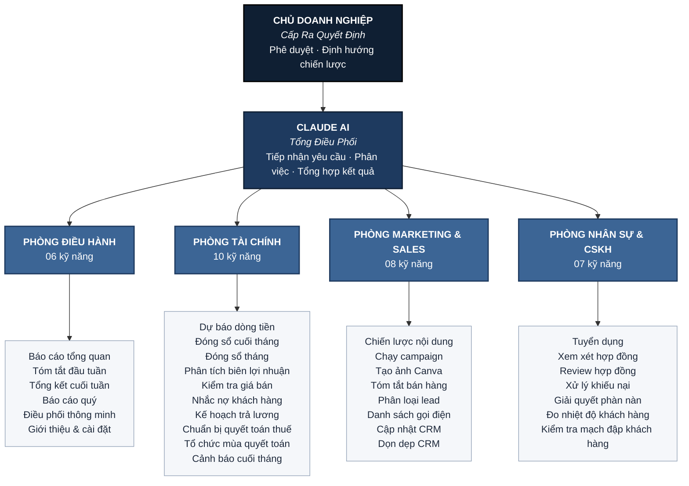
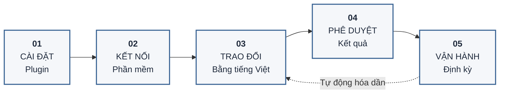

# Agent Teams cho Doanh Nghiệp Nhỏ — CES GLOBAL

> Bộ trợ lý AI tiếng Việt cho **Claude Cowork**, tổ chức theo mô hình phòng ban doanh nghiệp. 31 kỹ năng chuyên biệt hỗ trợ tự động hóa vận hành — mọi hành động đều thông qua phê duyệt của người dùng.

---

## Tổng Quan

**Agent Teams** là plugin dành riêng cho doanh nghiệp nhỏ và vừa Việt Nam (quy mô 1–50 nhân sự). Plugin sắp xếp 31 kỹ năng AI theo mô hình **04 phòng ban chuyên môn**, vận hành như một đội ngũ trợ lý ảo dưới sự điều phối của Claude.

| Phòng ban | Lĩnh vực phụ trách | Số kỹ năng |
|---|---|:---:|
| **Phòng Điều Hành** | Báo cáo tổng quan, điều phối, lập kế hoạch định kỳ | 6 |
| **Phòng Tài Chính** | Dòng tiền, kế toán, biên lợi nhuận, quyết toán thuế | 10 |
| **Phòng Marketing & Sales** | Nội dung, campaign, quản lý lead, vận hành CRM | 8 |
| **Phòng Nhân Sự & CSKH** | Tuyển dụng, hợp đồng, xử lý khiếu nại, đo lường feedback | 7 |

**Đối tượng sử dụng**

- Chủ doanh nghiệp nhỏ và vừa muốn tự động hóa các tác vụ vận hành định kỳ
- Đội ngũ kế toán, marketing, sales, HR muốn tăng năng suất mà không cần mở rộng nhân sự
- Tổ chức bắt đầu hành trình ứng dụng AI vào quy trình kinh doanh

**Nguyên tắc vận hành**

Claude không tự ý thực thi các hành động có ảnh hưởng đến tài chính, pháp lý, hoặc quan hệ khách hàng. Mọi đề xuất đều được trình bày để người dùng phê duyệt trước khi thực hiện.

---

## Sơ Đồ Tổ Chức AI Agent Teams

Plugin được thiết kế theo cấu trúc tổ chức ba cấp: **Cấp Ra Quyết Định** (người dùng) — **Cấp Điều Phối** (Claude AI) — **Cấp Chuyên Môn** (04 phòng ban).



**Quy trình xử lý yêu cầu (ví dụ)**

> Người dùng nhập: *"Tháng này dòng tiền sao rồi?"*
> → Claude AI phân tích yêu cầu → định tuyến đến **Phòng Tài Chính**
> → Kích hoạt kỹ năng **Dự báo dòng tiền** → kết nối phần mềm kế toán (QuickBooks)
> → Tổng hợp báo cáo → Trình bày cho người dùng phê duyệt hành động tiếp theo.

---

## Giá Trị Mang Lại Cho Doanh Nghiệp

Doanh nghiệp nhỏ thường thiếu nhân sự nhưng vẫn phải đảm bảo đủ chức năng vận hành như doanh nghiệp lớn. Agent Teams giải quyết khoảng trống này thông qua 06 nhóm giá trị cốt lõi:

| # | Nhóm giá trị | Mô tả |
|:---:|---|---|
| 01 | **Tối ưu thời gian lãnh đạo** | Giảm 10–20 giờ/tuần cho chủ doanh nghiệp ở các tác vụ báo cáo, nhắc nợ, soạn thảo email. |
| 02 | **Mở rộng năng lực không tăng nhân sự** | Một chủ doanh nghiệp cùng Claude tương đương đội ngũ kế toán bán thời gian + marketer + sales admin + HR. |
| 03 | **Đảm bảo tuân thủ định kỳ** | Cảnh báo sớm về dòng tiền, lương, nợ phải thu; báo cáo định kỳ không bị bỏ sót. |
| 04 | **Ra quyết định dựa trên dữ liệu** | Báo cáo P&L, dòng tiền, chất lượng lead, hiệu quả campaign đều dựa trên dữ liệu thật từ phần mềm kết nối. |
| 05 | **Kiểm soát rủi ro pháp lý &amp; tài chính** | Phát hiện điều khoản bất lợi trong hợp đồng, đối soát chéo sổ sách, chuẩn bị hồ sơ thuế đầy đủ. |
| 06 | **Nâng cao chất lượng dịch vụ khách hàng** | Phản hồi khiếu nại trong giờ; theo dõi mức độ hài lòng để giữ chân khách hàng. |

**So sánh hiệu quả thực tế**

| Tình huống | Trước khi triển khai | Sau khi triển khai |
|---|---|---|
| Lập báo cáo dòng tiền tháng | 2–3 giờ thao tác thủ công | 5 phút phê duyệt báo cáo |
| Soạn 10 email nhắc nợ | 1 giờ viết từng email | 10 phút duyệt bản nháp |
| Phân tích thứ tự ưu tiên lead | Đánh giá theo cảm tính | Xếp hạng theo dữ liệu CRM |
| Thiết kế 5 ấn phẩm mạng xã hội | 2 giờ thao tác Canva | 15 phút duyệt mẫu thiết kế |
| Rà soát hợp đồng 20 trang | 5.000.000 VNĐ phí luật sư | Tự động đánh dấu rủi ro, luật sư rà soát điểm trọng yếu |

---

## Mô Hình Triển Khai

### Quy trình vận hành 05 bước



### Lộ trình triển khai 04 tuần

**Tuần 01 — Khởi động**
Thời gian dự kiến: 2 giờ. Cài đặt Claude Cowork và plugin; kết nối 1–2 phần mềm trọng yếu (thường là QuickBooks và HubSpot); thực hiện truy vấn đầu tiên: *"Cho tôi xem tình hình kinh doanh hôm nay."*

**Tuần 02 — Triển khai mảng Tài Chính**
- Sáng thứ Hai: *"Tóm tắt tài chính tuần qua."*
- Giữa tuần: *"Khách hàng nào đang nợ tiền? Soạn email nhắc nợ."*
- Cuối tháng: *"Đóng sổ tháng và lập báo cáo P&L."*

**Tuần 03 — Triển khai mảng Marketing &amp; Sales**
- *"Top 5 lead cần ưu tiên gọi hôm nay."*
- *"Lên kế hoạch nội dung 30 ngày cho Facebook."*
- *"Thiết kế 5 ấn phẩm cho sản phẩm X."*

**Tuần 04 — Vận hành định kỳ**
Thiết lập các báo cáo tự động (báo cáo tuần, nhắc nợ, cập nhật CRM). Sử dụng theo nhu cầu phát sinh các kỹ năng tuyển dụng, rà soát hợp đồng, xử lý khiếu nại.

### Phân vai theo vị trí công việc

| Vị trí | Nhóm kỹ năng sử dụng |
|---|---|
| Chủ doanh nghiệp / CEO | Báo cáo tổng quan, định hướng chiến lược, phê duyệt hành động |
| Kế toán / Quản lý tài chính | Đóng sổ, đối soát, dự báo dòng tiền, chuẩn bị quyết toán |
| Marketing / Sales | Lên nội dung, chạy campaign, phân loại lead, vận hành CRM |
| HR / Hành chính | Đăng tin tuyển dụng, soạn offer, rà soát hợp đồng |
| Chăm sóc khách hàng | Xử lý khiếu nại, đo lường mức độ hài lòng |

> **Doanh nghiệp 1–5 nhân sự**: Một chủ doanh nghiệp có thể sử dụng toàn bộ 31 kỹ năng; plugin đóng vai trò đội ngũ trợ lý ảo.
>
> **Doanh nghiệp 10–50 nhân sự**: Mỗi nhân viên phụ trách nhóm kỹ năng thuộc phòng ban của mình; lãnh đạo sử dụng nhóm Điều Hành để giám sát tổng thể.

---

## Hướng Dẫn Cài Đặt

### Bước 01 — Cài đặt Claude Cowork

Tải ứng dụng desktop tại [claude.ai/download](https://claude.ai/download) và đăng nhập bằng tài khoản Claude (yêu cầu gói **Pro** hoặc **Teams**).

### Bước 02 — Cài đặt Plugin

1. Mở Claude Cowork.
2. Chọn biểu tượng **Plugin** trên thanh điều hướng bên trái.
3. Chọn **"Cài đặt từ file"** hoặc **"Install from GitHub"**.
4. Nhập URL: `https://github.com/Peternguyen91/agent-teams-sme-cesglobal`
5. Chọn **Cài đặt** và chờ khoảng 30 giây để hệ thống xử lý.

### Bước 03 — Kết nối phần mềm

Plugin hỗ trợ tích hợp 12 phần mềm phổ biến. Không yêu cầu kết nối toàn bộ — chỉ cần 1–2 phần mềm thiết yếu để bắt đầu.

| Phần mềm | Chức năng sử dụng |
|---|---|
| QuickBooks | Đọc dữ liệu tài chính, P&L, dòng tiền |
| PayPal | Theo dõi thanh toán, gửi nhắc nợ |
| HubSpot | Quản lý CRM, lead, pipeline bán hàng |
| Canva | Thiết kế ấn phẩm marketing |
| Google Gmail | Đọc email, soạn phản hồi khách hàng |
| Google Calendar | Quản lý lịch, lập kế hoạch tuần |
| Google Drive | Lưu trữ báo cáo, tài liệu tự động |
| Slack | Gửi thông báo nội bộ |
| Stripe / Square | Theo dõi doanh thu bán hàng |
| DocuSign | Ký kết hợp đồng điện tử |
| Microsoft 365 | Tích hợp Outlook, Teams |

**Quy trình kết nối**: Claude Cowork → Plugin → Chọn plugin → Tab **"Kết nối"** → Chọn phần mềm → Đăng nhập tài khoản.

### Bước 04 — Truy vấn đầu tiên

Sau khi cài đặt, có thể bắt đầu với câu lệnh:

```
"Cho tôi xem tình hình kinh doanh hôm nay"
```

Claude sẽ tự động thu thập dữ liệu từ các phần mềm đã kết nối và xuất báo cáo tổng quan.

---

## Mẫu Câu Tương Tác

Plugin được thiết kế để tiếp nhận câu hỏi bằng tiếng Việt tự nhiên, không yêu cầu cú pháp lệnh.

**Mảng Tài Chính**
- *"Tháng này dòng tiền như thế nào?"*
- *"Tôi có đủ tiền trả lương không?"*
- *"Khách hàng nào đang nợ tiền?"*
- *"Cho tôi xem P&L tháng trước."*
- *"Lợi nhuận theo từng dòng sản phẩm thế nào?"*

**Mảng Marketing**
- *"Tôi nên đăng nội dung gì trong tháng này?"*
- *"Soạn bài đăng Facebook cho sản phẩm X."*
- *"Chạy campaign email cho nhóm khách hàng cũ."*

**Mảng Bán Hàng**
- *"Hôm nay tôi nên gọi điện cho khách nào trước?"*
- *"Cập nhật CRM sau cuộc họp vừa kết thúc."*
- *"Phân tích pipeline bán hàng tuần này."*

**Mảng Nhân Sự**
- *"Tôi muốn tuyển một nhân viên kế toán."*
- *"Soạn thư mời nhận việc cho ứng viên X."*

**Mảng Chăm Sóc Khách Hàng**
- *"Khách đang phàn nàn về X, giúp tôi soạn phản hồi."*
- *"Rà soát hợp đồng này, có điểm bất thường nào không?"*

---

## Danh Mục 31 Kỹ Năng

### Phòng Điều Hành — Tổng Quan & Điều Phối

| Mã kỹ năng | Trường hợp sử dụng |
|---|---|
| `bao-cao-tong-quan` | Xem tình hình kinh doanh tổng thể |
| `dieu-phoi-thong-minh` | Tự động định tuyến yêu cầu đến đúng kỹ năng |
| `gioi-thieu-va-cai-dat` | Hướng dẫn lần đầu sử dụng, kết nối phần mềm |
| `tom-tat-dau-tuan` | Bản tin sáng thứ Hai, lập kế hoạch tuần |
| `tong-ket-cuoi-tuan` | Tóm tắt thứ Sáu, đánh giá kết quả tuần |
| `bao-cao-quy` | Báo cáo định kỳ quý cho ban lãnh đạo |

### Phòng Tài Chính

| Mã kỹ năng | Trường hợp sử dụng |
|---|---|
| `du-bao-dong-tien` | Dự báo dòng tiền 30/60/90 ngày |
| `dong-so-cuoi-thang` | Đối soát sổ sách, đóng tháng |
| `dong-so-thang` | Đối soát QuickBooks với cổng thanh toán |
| `phan-tich-bien-loi-nhuan` | Phân tích biên lợi nhuận theo sản phẩm/dịch vụ |
| `kiem-tra-gia-ban` | Đánh giá chính sách giá theo sản phẩm |
| `nhac-no-khach-hang` | Gửi nhắc nợ khách hàng chưa thanh toán |
| `ke-hoach-tra-luong` | Đảm bảo đủ dòng tiền chi trả lương |
| `chuan-bi-quyet-toan-thue` | Chuẩn bị tài liệu cho kế toán thuế |
| `to-chuc-mua-quyet-toan` | Tổ chức tài liệu cuối năm tài chính |
| `canh-bao-cuoi-thang` | Cảnh báo sớm ngày 25 hàng tháng |

### Phòng Marketing & Sales

| Mã kỹ năng | Trường hợp sử dụng |
|---|---|
| `chien-luoc-noi-dung` | Lên kế hoạch nội dung 30 ngày |
| `chay-campaign` | Triển khai campaign đầu cuối |
| `tao-anh-canva` | Tự động tạo ấn phẩm mạng xã hội |
| `tom-tat-ban-hang` | Báo cáo sản phẩm bán chạy/chậm |
| `phan-loai-lead` | Xếp hạng lead theo mức ưu tiên |
| `danh-sach-goi-dien` | Danh sách khách cần gọi trong ngày |
| `cap-nhat-crm` | Cập nhật HubSpot sau giao dịch |
| `don-dep-crm` | Làm sạch dữ liệu CRM cũ |

### Phòng Nhân Sự & CSKH

| Mã kỹ năng | Trường hợp sử dụng |
|---|---|
| `tuyen-dung` | Đăng tuyển, phỏng vấn, soạn thư mời nhận việc |
| `xem-xet-hop-dong` | Phát hiện rủi ro pháp lý trong hợp đồng |
| `review-hop-dong` | Rà soát hợp đồng nâng cao |
| `xu-ly-khieu-nai` | Soạn phản hồi khiếu nại khách hàng |
| `giai-quyet-phan-nan` | Xử lý phàn nàn đầu cuối |
| `do-nhiet-do-khach-hang` | Tổng hợp feedback, phân tích xu hướng |
| `kiem-tra-mach-dap-khach-hang` | Phân tích top 3 vấn đề khách phàn nàn |

---

## Câu Hỏi Thường Gặp

**Plugin có truy cập dữ liệu thật của doanh nghiệp?**
Có. Khi kết nối phần mềm (QuickBooks, HubSpot...), Claude sẽ đọc dữ liệu thực để xử lý. Dữ liệu chỉ sử dụng trong phiên làm việc và không được lưu trữ.

**Claude có tự động gửi email hoặc chuyển tiền?**
Không. Claude luôn trình bày kết quả và hỏi xác nhận trước mọi hành động ảnh hưởng đến tài chính hoặc khách hàng.

**Có sử dụng được nếu không có QuickBooks?**
Có. Người dùng có thể cung cấp số liệu trực tiếp qua hội thoại (ví dụ: *"Doanh thu tháng 5 là 200 triệu, chi phí 130 triệu"*) và Claude sẽ phân tích dựa trên thông tin được cung cấp.

**Có yêu cầu kiến thức kỹ thuật để sử dụng?**
Không. Người dùng chỉ cần giao tiếp bằng tiếng Việt tự nhiên với Claude.

**Plugin có phù hợp nếu doanh nghiệp không dùng các phần mềm tích hợp?**
Có. Nhiều kỹ năng hoạt động độc lập với thông tin được cung cấp qua hội thoại.

---

## Về CES GLOBAL

### Giới thiệu

**Công ty Cổ phần Công nghệ Trí tuệ Nhân tạo CES GLOBAL** là đơn vị tiên phong trong lĩnh vực đào tạo, tư vấn và triển khai AI cho doanh nghiệp tại Việt Nam. CES Global đặt mục tiêu trở thành đơn vị dẫn đầu về đào tạo AI và các giải pháp đổi mới đột phá, đồng hành cùng doanh nghiệp Việt trong kỷ nguyên số.

> **Sứ mệnh**: Lấy *con người* làm trung tâm, *bảo mật dữ liệu* là nguyên tắc cốt lõi, và *sự phát triển bền vững của khách hàng* là thước đo thành công.

### Lĩnh vực hoạt động

| Lĩnh vực | Mô tả |
|---|---|
| **Đào tạo AI** | Xây dựng khung năng lực AI cho doanh nghiệp, đào tạo nhân sự ứng dụng AI vào công việc thực tế |
| **Tư vấn chiến lược AI-First** | Tư vấn lộ trình chuyển đổi số và triển khai AI Agent vào vận hành |
| **Triển khai giải pháp AI** | Tối ưu vận hành, nâng cao hiệu quả kinh doanh, kiến tạo lợi thế cạnh tranh |
| **Agentic AI & Automation** | Phát triển các AI Agent chuyên biệt theo ngành và phòng ban |

### Khách hàng tiêu biểu

CES GLOBAL đã đào tạo và triển khai giải pháp AI cho nhiều tập đoàn lớn tại Việt Nam:

**Maritime Group** &nbsp;·&nbsp; **Hòa Phát** &nbsp;·&nbsp; **Bảo Việt** &nbsp;·&nbsp; **VNPT** &nbsp;·&nbsp; **MobiFone** &nbsp;·&nbsp; **TH True Milk**

### Thông tin liên hệ

| | | |
|---|---|---|
| **Trụ sở** | | 222 Nguyễn Văn Tuyết, Trung Liệt, Đống Đa, Hà Nội |
| **Website** | | [cesglobal.com.vn](https://cesglobal.com.vn/) |
| **Email** | | cesglobal.ai@gmail.com |
| **Hotline** | | 091 199 12 88 |

---

## Hỗ Trợ & Đóng Góp

- **Báo lỗi / Đề xuất tính năng**: Tạo [Issue](https://github.com/Peternguyen91/agent-teams-sme-cesglobal/issues) trên repository.
- **Đóng góp bản dịch hoặc kỹ năng mới**: Gửi Pull Request với file `SKILL.md` đã cập nhật.
- **Liên hệ tư vấn doanh nghiệp**: Email `cesglobal.ai@gmail.com` hoặc hotline **091 199 12 88**.

---

*Phát triển bởi **CES GLOBAL** — Nâng tầm doanh nghiệp Việt bằng AI.*
