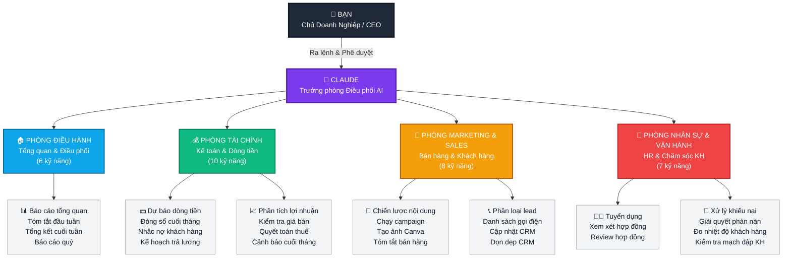

# 🤖 Agent Teams cho Doanh Nghiệp Nhỏ — CESGLOBAL

> **Plugin Claude Cowork 100% Tiếng Việt** — Bộ trợ lý AI tự động hóa vận hành cho doanh nghiệp nhỏ Việt Nam. Claude làm việc như một đội ngũ trợ lý thông minh: bạn ra lệnh, Claude thực thi, và **bạn phê duyệt mọi bước quan trọng**.

---

## 📖 Giới Thiệu — Đọc Trước Khi Dùng

### Plugin này là gì?

Đây là một **bộ kỹ năng (plugin)** dành cho Claude Cowork — ứng dụng desktop của Claude dành cho công việc. Khi cài plugin này, Claude sẽ có thêm **31 kỹ năng chuyên biệt** giúp bạn điều hành doanh nghiệp, bao gồm:

- 📊 **Tài chính**: Xem dòng tiền, đóng sổ cuối tháng, lập báo cáo P&L, cảnh báo thanh khoản
- 📣 **Marketing**: Lên chiến lược nội dung, tạo ảnh Canva, chạy campaign email
- 🤝 **Bán hàng & CRM**: Phân loại lead, cập nhật HubSpot, gọi điện cho khách ưu tiên
- 👥 **Nhân sự**: Đăng tuyển dụng, tạo gói offer, chuẩn bị phỏng vấn
- ⚙️ **Vận hành**: Xử lý khiếu nại, soạn phản hồi khách hàng, xem xét hợp đồng

### 🏢 Sơ đồ Tổ chức AI Agent Teams

Plugin tổ chức 31 kỹ năng theo mô hình phòng ban như một doanh nghiệp thật. Bạn là **Giám đốc**, Claude là **Trưởng phòng Điều phối** dẫn dắt 4 phòng ban chuyên môn:



> 💡 **Cách hoạt động**: Bạn chỉ cần nói chuyện tự nhiên với Claude. Claude sẽ tự nhận biết yêu cầu thuộc phòng ban nào và gọi đúng kỹ năng tương ứng — như cách một CEO giao việc cho từng phòng ban.

### Ai nên dùng plugin này?

- Chủ doanh nghiệp nhỏ/vừa (1–50 nhân viên)
- Người mới bắt đầu dùng Claude Cowork và muốn áp dụng ngay vào công việc
- Team muốn tự động hóa các tác vụ lặp đi lặp lại mà không cần thuê thêm nhân sự

### Claude hoạt động như thế nào với plugin này?

```
Bạn nói chuyện với Claude bằng tiếng Việt bình thường
         ↓
Claude tự nhận biết bạn cần kỹ năng gì
         ↓
Claude kết nối với các phần mềm của bạn (QuickBooks, HubSpot, v.v.)
         ↓
Claude thực hiện công việc và trình bày kết quả
         ↓
Bạn phê duyệt hoặc điều chỉnh trước khi Claude thực thi
```

> ⚠️ **Nguyên tắc vàng**: Claude **không bao giờ** tự ý chuyển tiền, gửi email đến khách hàng, hoặc đăng nội dung mà không có sự phê duyệt của bạn.

---

## 🚀 Hướng Dẫn Cài Đặt

### Bước 1: Cài Claude Cowork

Tải Claude desktop app từ [claude.ai/download](https://claude.ai/download) và đăng nhập bằng tài khoản Claude của bạn (cần gói Pro hoặc Teams).

### Bước 2: Cài Plugin Này

1. Mở Claude Cowork
2. Click vào biểu tượng **Plugin** ở thanh bên trái
3. Click **"Cài đặt từ file"** hoặc **"Install from GitHub"**
4. Nhập URL: `https://github.com/cesglobal/agent-teams-doanh-nghiep-nho-cesglobal`
5. Click **Cài đặt** và chờ 30 giây

### Bước 3: Kết Nối Phần Mềm Của Bạn

Plugin hỗ trợ 12 phần mềm phổ biến. **Bạn không cần kết nối tất cả** — kết nối ít nhất 1-2 phần mềm là có thể bắt đầu ngay:

| Phần mềm | Dùng để làm gì |
|----------|----------------|
| **QuickBooks** | Đọc dữ liệu tài chính, P&L, dòng tiền |
| **PayPal** | Theo dõi thanh toán, gửi nhắc nợ |
| **HubSpot** | Quản lý CRM, lead, pipeline bán hàng |
| **Canva** | Tạo ảnh marketing tự động |
| **Google Gmail** | Đọc email, soạn phản hồi khách hàng |
| **Google Calendar** | Xem lịch, lên kế hoạch tuần |
| **Google Drive** | Lưu báo cáo, tài liệu tự động |
| **Slack** | Gửi thông báo nội bộ cho team |
| **Stripe / Square** | Theo dõi doanh thu bán hàng |
| **DocuSign** | Ký hợp đồng điện tử |
| **Microsoft 365** | Tích hợp Outlook, Teams |
| **Canva** | Thiết kế marketing |

**Cách kết nối**: Trong Claude Cowork → Plugin → Chọn plugin này → Tab "Kết nối" → Chọn phần mềm → Đăng nhập tài khoản của bạn.

### Bước 4: Bắt Đầu Ngay

Sau khi cài xong, hãy thử ngay câu đầu tiên:

```
"Cho tôi xem tình hình kinh doanh hôm nay"
```

Claude sẽ tự động thu thập dữ liệu từ các phần mềm đã kết nối và tạo báo cáo tổng quan cho bạn.

---

## 💬 Cách Sử Dụng — Nói Chuyện Tự Nhiên

Plugin này được thiết kế để bạn **nói chuyện tự nhiên bằng tiếng Việt**, không cần nhớ lệnh phức tạp.

### Ví dụ các câu bạn có thể nói:

**Tài chính:**
- *"Tháng này dòng tiền như thế nào?"*
- *"Tôi có đủ tiền trả lương không?"*
- *"Khách nào đang nợ tiền tôi?"*
- *"Cho tôi xem P&L tháng trước"*
- *"Lợi nhuận theo sản phẩm thế nào?"*

**Marketing:**
- *"Tôi nên đăng gì trong tháng này?"*
- *"Tạo bài đăng Facebook cho sản phẩm X"*
- *"Chạy campaign email cho khách hàng cũ"*

**Bán hàng:**
- *"Hôm nay tôi nên gọi cho ai trước?"*
- *"Cập nhật CRM sau cuộc họp vừa rồi"*
- *"Phân tích pipeline bán hàng tuần này"*

**Nhân sự:**
- *"Tôi muốn tuyển 1 nhân viên kế toán"*
- *"Soạn offer letter cho ứng viên X"*

**Khách hàng:**
- *"Khách đang phàn nàn về X, giúp tôi soạn phản hồi"*
- *"Xem xét hợp đồng này có vấn đề gì không?"*

---

## 📋 Danh Sách 31 Kỹ Năng

### 🏠 Nhóm 1 — Tổng Quan & Điều Phối (Dùng Hàng Ngày)

| Kỹ năng | Khi nào dùng |
|---------|--------------|
| **bao-cao-tong-quan** | Xem tình hình kinh doanh tổng thể |
| **dieu-phoi-thong-minh** | Claude tự hiểu bạn cần gì và dẫn đến đúng kỹ năng |
| **gioi-thieu-va-cai-dat** | Lần đầu dùng, kết nối phần mềm |
| **tom-tat-dau-tuan** | Bản tin sáng thứ 2, lên kế hoạch tuần |
| **tong-ket-cuoi-tuan** | Tóm tắt thứ 6, đánh giá kết quả |
| **bao-cao-quy** | Báo cáo quý cho ban lãnh đạo |

### 💰 Nhóm 2 — Tài Chính (Quan Trọng Nhất)

| Kỹ năng | Khi nào dùng |
|---------|--------------|
| **dong-so-cuoi-thang** | Đối soát sổ sách, đóng tháng |
| **du-bao-dong-tien** | Dự báo 30/60/90 ngày tiền mặt |
| **phan-tich-bien-loi-nhuan** | Xem margin theo sản phẩm/dịch vụ |
| **nhac-no-khach-hang** | Gửi nhắc nhở khách chưa thanh toán |
| **ke-hoach-tra-luong** | Đảm bảo đủ tiền trả lương |
| **kiem-tra-gia-ban** | Phân tích giá theo sản phẩm |
| **chuan-bi-quyet-toan-thue** | Tài liệu cho kế toán thuế |
| **to-chuc-mua-quyet-toan** | Chuẩn bị tài liệu cuối năm |
| **dong-so-thang** | Đối soát QuickBooks vs cổng thanh toán |
| **canh-bao-cuoi-thang** | Cảnh báo sớm ngày 25 hàng tháng |

### 📣 Nhóm 3 — Marketing & Bán Hàng

| Kỹ năng | Khi nào dùng |
|---------|--------------|
| **chien-luoc-noi-dung** | Lên kế hoạch nội dung 30 ngày |
| **chay-campaign** | Chạy campaign đầu đến cuối |
| **phan-loai-lead** | Xếp hạng lead ưu tiên |
| **tao-anh-canva** | Tự động tạo ảnh đăng mạng xã hội |
| **tom-tat-ban-hang** | Top sản phẩm bán chạy/chậm |
| **danh-sach-goi-dien** | 5 khách cần gọi hôm nay |
| **cap-nhat-crm** | Cập nhật HubSpot tự động |
| **don-dep-crm** | Dọn dẹp dữ liệu CRM cũ |

### 👥 Nhóm 4 — Nhân Sự & Vận Hành

| Kỹ năng | Khi nào dùng |
|---------|--------------|
| **tuyen-dung** | Đăng tuyển, phỏng vấn, offer letter |
| **xem-xet-hop-dong** | Phát hiện rủi ro trong hợp đồng |
| **review-hop-dong** | Phiên bản nâng cao xem xét hợp đồng |
| **xu-ly-khieu-nai** | Soạn phản hồi khiếu nại khách hàng |
| **giai-quyet-phan-nan** | Xử lý phàn nàn đầu đến cuối |
| **do-nhiet-do-khach-hang** | Tổng hợp feedback, phân tích xu hướng |
| **kiem-tra-mach-dap-khach-hang** | Phân tích top 3 vấn đề khách phàn nàn |

---

## ❓ Câu Hỏi Thường Gặp

**Q: Plugin có đọc được dữ liệu thật của doanh nghiệp tôi không?**
A: Có, khi bạn kết nối phần mềm (QuickBooks, HubSpot...) Claude sẽ đọc dữ liệu thực của bạn. Dữ liệu này chỉ dùng trong phiên làm việc đó và không được lưu lại.

**Q: Claude có tự ý gửi email hoặc chuyển tiền không?**
A: Không bao giờ. Claude luôn trình bày kết quả và hỏi bạn "Bạn có muốn thực hiện không?" trước mọi hành động ảnh hưởng đến tiền hoặc khách hàng.

**Q: Tôi không có QuickBooks thì có dùng được không?**
A: Được. Bạn có thể cung cấp số liệu trực tiếp qua chat (ví dụ: "Doanh thu tháng 5 là 200 triệu, chi phí là 130 triệu"), Claude sẽ phân tích dựa trên thông tin bạn cung cấp.

**Q: Có cần biết kỹ thuật để dùng không?**
A: Không. Chỉ cần biết gõ tiếng Việt và nói chuyện bình thường với Claude là đủ.

**Q: Plugin có phù hợp với doanh nghiệp tôi không nếu tôi không dùng các phần mềm trên?**
A: Vẫn phù hợp. Nhiều kỹ năng hoạt động tốt chỉ với thông tin bạn cung cấp qua chat, không cần phần mềm nào cả.

---

## 🛠️ Hỗ Trợ & Đóng Góp

- **Website**: [cesglobal.vn](https://cesglobal.vn)
- **Báo lỗi**: Tạo Issue trên GitHub repo này
- **Đóng góp bản dịch**: Gửi Pull Request với file SKILL.md đã cập nhật

---

## 📜 Bản Quyền

Plugin này được phát triển bởi **CESGLOBAL** dựa trên nền tảng [small-business plugin](https://github.com/anthropics/knowledge-work-plugins) của Anthropic (MIT License). Bản dịch tiếng Việt và các điều chỉnh cho thị trường Việt Nam thuộc quyền sở hữu của CESGLOBAL.

---

*Được tạo bởi CESGLOBAL — Nâng tầm doanh nghiệp Việt với AI* 🇻🇳
